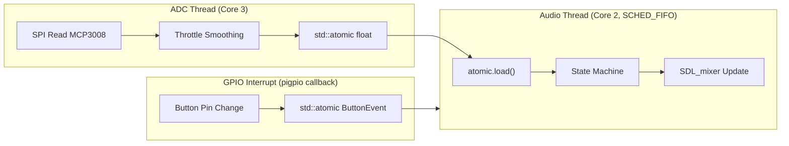

# C++ EV Sound Simulator Rewrite

## Architecture Overview

## Build Order

Every step writes real, final code. Nothing gets thrown away. The order follows dependencies -- you can't write the state machine until the sound manager exists, because the state machine calls sound manager methods.

### Step 1: `config.h` (DONE)
All project constants as `constexpr`. Already written and reviewed.

### Step 2: `sound_manager.h` / `sound_manager.cpp` -- The audio engine
Write the full `SoundManager` class. This is the heart of the project and the largest piece.

**What it ports from Python** (lines 161-420 of `main_final.py`):
- Constructor initializes SDL_mixer channels, sets up internal state
- `load_sounds()` dispatches to `load_m4_sounds()` / `load_supra_sounds()` based on profile
- `play_idle()`, `play_startup()`, `play_staged_rev()`, `play_long_sequence()` with crossfade
- `update_idle_fade()`, `update_long_sequence_crossfade()`, `update()` for launch control
- `switch_profile()`, `stop_all_sounds()`, `stop_long_sequence()`, `is_long_sequence_busy()`
- Destructor frees all `Mix_Chunk*` resources

**Key C++ you'll learn by writing this**:
- Classes with constructors and destructors
- `std::map<std::string, Mix_Chunk*>` for sound storage
- `std::vector` for rev stages
- RAII -- the destructor cleans up SDL resources automatically
- Pointers (SDL_mixer returns raw `Mix_Chunk*` pointers you must free)

### Step 3: `behavior.h` -- Abstract base class
Write the `BaseBehavior` base class that M4 and Supra both inherit from.

**What it ports** (lines 424-434):
- `enum class State` with all possible states (ENGINE_OFF, STARTING, IDLING, etc.)
- Pure virtual `update(float dt, float throttle)` method
- Protected members: `SoundManager*` pointer, current state, current throttle, time_in_state
- Virtual destructor

**Key C++ you'll learn**: inheritance, pure virtual functions (`= 0`), `enum class`, virtual destructors

### Step 4: `m4_behavior.h` / `m4_behavior.cpp` -- M4 state machine
Write the full M4 behavior with all state transitions and gesture detection.

**What it ports** (lines 436-588):
- The complete state machine: ENGINE_OFF -> STARTING -> IDLING -> PLAYFUL_REV / ACCELERATING / CRUISING / DECELERATING / LAUNCH_HOLD
- `_check_playful_gestures()` with throttle history tracking
- All timing constants as class members
- Simulated RPM tracking

**Key C++ you'll learn**: `std::deque`, `switch` on `enum class`, method implementation in `.cpp` files separate from `.h` declarations

### Step 5: `supra_behavior.h` / `supra_behavior.cpp` -- Supra state machine
Write the full Supra behavior with clip selection and rev gestures.

**What it ports** (lines 589-745):
- State machine: ENGINE_OFF -> STARTING -> IDLE -> LIGHT_CRUISE / AGGRESSIVE_PUSH / VIOLENT_PULL
- `play_clip_for_state()` with anti-repeat filtering
- `_check_rev_gesture()` and `_reset_gesture_detection()`

**Key C++ you'll learn**: `<random>` for clip selection, `std::vector<std::string>` for clip lists, reinforces patterns from Step 4

### Step 6: `hardware.h` / `hardware.cpp` -- Hardware + threading
Write the hardware abstraction layer. This is where multithreading and interrupts live.

**What it ports** (lines 78-159) plus new threading:
- `std::atomic<float> shared_throttle` -- bridge between ADC thread and audio thread
- `std::atomic<int> shared_button_event` -- bridge between GPIO interrupt and audio thread
- `adc_thread_func()` -- reads SPI, smooths with local `std::deque`, writes to atomic
- `button_isr_callback()` -- pigpio interrupt callback, handles press timing, writes to atomic
- `initialize_hardware()` / `shutdown_hardware()` -- setup + thread launch/join
- `get_throttle_percentage(int raw)` -- pure math, no hardware needed
- All Pi-specific code behind `#ifdef RASPI_HW`, stubs for Windows development

**Key C++ you'll learn**: `std::thread`, `std::atomic`, `#ifdef` conditional compilation, function pointers for callbacks

### Step 7: `logging.h` / `logging.cpp` -- Logging and display
Write the CSV logger and terminal status display.

**What it ports** (lines 753-759 display, lines 866-875 CSV writing):
- `update_display()` -- prints status line with `\r` for in-place updates
- `CsvLogger` class -- accumulates entries, writes on shutdown via `std::ofstream`
- Timestamps via `std::chrono`

**Key C++ you'll learn**: `std::ofstream`, `std::chrono`, `printf` formatting, `std::vector` of structs

### Step 8: `main.cpp` -- The real main
Write the complete main function that wires everything together.

**What it ports** (lines 761-896) plus advanced OS techniques:
- Signal handling (`std::signal` sets `std::atomic<bool> running = false`)
- SDL2 + SDL_mixer initialization
- Real-time scheduling: `sched_setscheduler(SCHED_FIFO)` + `mlockall` (behind `#ifdef RASPI_HW`)
- CPU core pinning: audio thread on core 2, ADC thread on core 3 (behind `#ifdef RASPI_HW`)
- Hardware initialization (launches ADC thread)
- Create SoundManager and initial Behavior
- Main loop: read atomics -> check button -> update behavior -> update display -> sleep
- Profile switching: destroy old behavior, create new SoundManager + Behavior
- Cleanup: join threads, free audio, GPIO cleanup, save CSV, optional `system("shutdown")`

**Key C++ you'll learn**: pulling everything together, `std::unique_ptr` for polymorphic behavior, `sched_setscheduler`, `mlockall`, `sched_setaffinity`

### Step 9: `CMakeLists.txt` -- Build system
Write the CMake configuration.

- `find_package` for SDL2, SDL2_mixer
- Conditional pigpio linking behind an option flag
- Link pthread for `std::thread`
- Set C++17 standard

## Advanced Techniques Summary

- **Multithreading**: ADC thread + audio thread, bridged by `std::atomic<float>` (in `hardware.cpp`)
- **Real-time scheduling**: `SCHED_FIFO` + `mlockall` (in `main.cpp`)
- **CPU core pinning**: `sched_setaffinity` per thread (in `main.cpp` + `hardware.cpp`)
- **Interrupt-driven button**: `gpioSetISRFunc` callback writes to atomic (in `hardware.cpp`)
- **Atomic signal handling**: `std::atomic<bool> running` (in `main.cpp`)

## Development Environment Note

Since you're on Windows, you can develop and test the audio/state-machine logic locally using SDL2 with keyboard-simulated throttle. The threading, real-time scheduling, GPIO interrupts, and SPI code compile only behind `#ifdef RASPI_HW`. On Windows, `shared_throttle` can be driven by keyboard input in the main loop instead.
