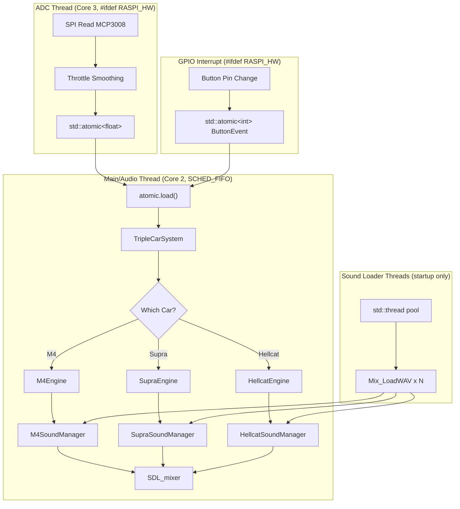

# C++ EV Sound Simulator Rewrite

**Source file**: `Main_REV3.py` (3055 lines) -- Triple-car system (M4 + Supra + Hellcat)

## Architecture Overview



## File Map

| File | Lines (est.) | What It Contains |
|---|---|---|
| `config.h` | ~200 | All constants: M4, Supra, Hellcat params, channel defs, hardware config |
| `sound_loader.h/.cpp` | ~120 | `OptimizedSoundLoader` -- parallel WAV loading with thread pool |
| `m4_sound_manager.h/.cpp` | ~450 | M4 audio: idle, sfx, long sequence A/B, staged rev, launch control sounds, offsets |
| `supra_sound_manager.h/.cpp` | ~400 | Supra audio: idle, driving A/B crossfade, rev sfx, throttle-range clip selection |
| `hellcat_sound_manager.h/.cpp` | ~650 | Hellcat layered audio: foundation/character/SFX layers, audio inertia, rev queue |
| `engine_simulation.h` | ~50 | Base class: `enum class State`, virtual `update()`, common members |
| `m4_engine.h/.cpp` | ~350 | M4 state machine: RPM-aware revs, launch control, gesture detection |
| `supra_engine.h/.cpp` | ~400 | Supra state machine: EMA throttle, PRE_ACCEL, audio queue, rev gestures |
| `hellcat_engine.h/.cpp` | ~350 | Hellcat state machine: virtual RPM, 5-speed auto, gear physics, simple revs |
| `triple_car_system.h/.cpp` | ~200 | Orchestrator: car array, switching with crossfade, throttle buffer, routing |
| `hardware.h/.cpp` | ~200 | ADC thread, GPIO button, throttle math, `#ifdef RASPI_HW` stubs |
| `logging.h/.cpp` | ~200 | CSV logger with car-specific fields, terminal status display |
| `main.cpp` | ~200 | SDL init, SCHED_FIFO, core pinning, signal handling, main loop, cleanup |
| `CMakeLists.txt` | ~40 | Build config |

**Total**: ~20 files, ~3800 estimated lines of C++

## Build Order

Every step writes real, final code. Nothing gets thrown away. The order follows dependencies -- you can't write the engine simulation until the sound manager it calls exists.

---

### Step 1: `config.h` -- All project constants

All project constants as `constexpr`. This file has no dependencies and everything else includes it.

**What it ports from `Main_REV3.py`** (lines 28-173):
- Common: `FPS`, `THROTTLE_DEADZONE_LOW`, `THROTTLE_SMOOTHING_WINDOW_SIZE`, `MASTER_ENGINE_VOL`
- Hardware: `ADC_CHANNEL_NUMBER`, `MIN_ADC_VALUE`, `MAX_ADC_VALUE`, `BUTTON_GPIO_PIN`, `BUTTON_LONG_PRESS_TIME`, `BUTTON_DEBOUNCE_TIME`
- Audio mixer: `MIXER_FREQUENCY`, `MIXER_SIZE`, `MIXER_CHANNELS_STEREO`, `MIXER_BUFFER`, `NUM_PYGAME_MIXER_CHANNELS` (25)
- M4 constants: all `M4_*` params (sustained throttle time, gesture window, crossfade, idle volumes, launch control range, RPM params, staged rev volume, acceleration offsets)
- Supra constants: all `SUPRA_*` params (idle volume, rev gesture window, EMA alpha, RPM params, crossfade duration, cruise transition delay, highway cruise threshold, pre-accel delay, clip overlap prevention)
- Hellcat constants: all `HELLCAT_*` params (idle volume, crossfade duration, RPM physics, gear multiplier arrays, gear braking arrays, downshift thresholds, audio inertia speed, EMA alpha, min shift interval, fade durations)
- Channel definitions: `M4_CH_*` (0-4), `SUPRA_CH_*` (5-8), `HELLCAT_CH_*` (9-19)
- Sound file paths: `M4_SOUND_FILES_PATH`, `SUPRA_SOUND_FILES_PATH`, `HELLCAT_SOUND_FILES_PATH`
- Logging: `DISPLAY_UPDATE_INTERVAL`, `LOG_FILE_NAME`

**Key C++ concepts**:
- `constexpr` for compile-time constants (replaces Python's module-level variables)
- `constexpr std::array` for Hellcat gear multiplier/braking/downshift tables (O(1) indexed lookup, zero runtime overhead -- replaces Python's `dict` lookups)
- `#pragma once` include guard

---

### Step 2: `sound_loader.h` / `sound_loader.cpp` -- Parallel sound loading

Ports `OptimizedSoundLoader` (lines 222-309). This class is used by all three sound managers during their `load_sounds()` calls.

**What it ports**:
- `_load_sound_with_duration()` -- loads a single WAV via `Mix_LoadWAV`, calculates duration from chunk metadata, logs file size and load time
- `load_sounds_parallel()` -- spawns N `std::thread` workers from a task queue, collects results, prints summary with timing stats and slow-file identification
- Thread-safe result collection (loaded `Mix_Chunk*` pointers and durations)

**Key C++ concepts**:
- `std::thread` with a shared work queue
- `std::mutex` + `std::lock_guard` to protect the results map during parallel writes
- `std::map<std::string, Mix_Chunk*>` for returning loaded sounds
- `std::filesystem::exists` and `std::filesystem::file_size` for file checks
- RAII thread joining (all threads joined before returning results)

---

### Step 3: `m4_sound_manager.h` / `m4_sound_manager.cpp` -- M4 audio engine

Ports `M4SoundManager` (lines 311-732). The most complex of the three sound managers due to launch control logic and sound offset scheduling.

**What it ports**:
- Constructor: initializes 5 SDL_mixer channels (`M4_CH_IDLE`, `M4_CH_TURBO_LIMITER_SFX`, `M4_CH_LONG_SEQUENCE_A`, `M4_CH_LONG_SEQUENCE_B`, `M4_CH_STAGED_REV_SOUND`), sets up volume/fade/launch-control state
- `load_sounds()` -- uses `OptimizedSoundLoader` to parallel-load 13 WAV files, maps results to internal keys, builds `rev_stages` vector with RPM peaks and durations
- `update()` -- manages launch control hold-loop transition, pending offset sounds, launch control deactivation logic
- `play_idle()`, `set_idle_target_volume()`, `update_idle_fade()`, `stop_idle()`
- `play_staged_rev(current_rpm, gesture_peak_throttle)` -- RPM-aware rev selection (4-stage with RPM-based promotion to higher stages)
- `play_turbo_or_limiter_sfx()`, `stop_turbo_limiter_sfx()`, `is_turbo_limiter_sfx_busy()`, `any_playful_sfx_active()`
- `play_starter_sfx()` -- starter sound on the SFX channel with launch control awareness
- `play_launch_control_sequence()`, `stop_launch_control_sequence()`, `is_launch_control_active()`
- `play_long_sequence(sound_key, loops, transition_from_other, start_offset)` -- dual-channel crossfade with offset scheduling
- `update_long_sequence_crossfade()`, `stop_long_sequence()`, `is_long_sequence_busy()`
- `stop_all_sounds()`, `fade_out_all_sounds()`
- `get_sound_name_from_obj()` -- reverse lookup for logging
- Destructor: frees all `Mix_Chunk*` via `Mix_FreeChunk`

**Key C++ concepts**:
- RAII for SDL audio resources (destructor frees chunks)
- `std::map<std::string, Mix_Chunk*>` for sound storage
- `std::vector<RevStage>` for staged rev data
- `std::vector<PendingOffsetSound>` for the offset scheduling queue
- Raw pointer management (SDL returns `Mix_Chunk*` that must be manually freed)

---

### Step 4: `supra_sound_manager.h` / `supra_sound_manager.cpp` -- Supra audio engine

Ports `SupraSoundManager` (lines 734-1156). Different architecture from M4 -- uses a driving sound system with throttle-range-based clip selection.

**What it ports**:
- Constructor: initializes 4 channels (`SUPRA_CH_IDLE`, `SUPRA_CH_DRIVING_A`, `SUPRA_CH_DRIVING_B`, `SUPRA_CH_REV_SFX`), sets up crossfade and clip tracking state
- `load_sounds()` -- parallel-loads ~23 WAV files (idle, startup, light pulls/cruises, aggressive pushes, violent pulls, highway cruise, staged revs, original revs), builds categorized clip lists and `rev_stages`
- `play_driving_sound(throttle, force_type, crossfade)` -- selects clip based on throttle range and type (pull/push/cruise/highway_cruise), handles crossfade between driving A/B channels, tracks clip start time for overlap prevention
- `get_throttle_range()` -- maps throttle float to range string (idle/light/aggressive/violent/highway)
- `play_staged_rev(current_rpm, gesture_peak_throttle)` -- RPM-aware rev selection (4-stage, same logic structure as M4)
- `play_rev_sound()` -- simple fallback rev method for backwards compatibility
- `set_idle_target_volume()`, `update_idle_fade()`, `play_idle()`, `stop_idle()`
- `update_driving_crossfade()`, `is_driving_sound_busy()`, `stop_driving_sounds()`
- `play_startup_sound()` -- startup on rev SFX channel
- `stop_all_sounds()`, `fade_out_all_sounds()`, `is_rev_sound_busy()`
- `get_sound_name_from_obj()` -- reverse lookup for logging

**Key C++ concepts**:
- `std::vector<std::string>` for categorized clip lists (`light_pull_sounds`, `aggressive_push_sounds`, etc.)
- `<random>` (`std::mt19937` + `std::uniform_int_distribution`) for clip selection
- Enum or string-based throttle range classification

---

### Step 5: `hellcat_sound_manager.h` / `hellcat_sound_manager.cpp` -- Hellcat layered audio engine

Ports `HellcatSoundManager` (lines 1157-1777). Completely different architecture from M4/Supra -- a layered audio system with 11 channels.

**What it ports**:
- Constructor: initializes 11 channels across three layers:
  - Foundation: `HELLCAT_CH_IDLE`, `HELLCAT_CH_RUMBLE_LOW`, `HELLCAT_CH_RUMBLE_MID`, `HELLCAT_CH_WHINE_LOW_A/B`, `HELLCAT_CH_WHINE_HIGH_A/B`
  - Character: `HELLCAT_CH_ACCEL_RESPONSE`, `HELLCAT_CH_DECEL_BURBLE`
  - SFX: `HELLCAT_CH_STARTUP`, `HELLCAT_CH_SHIFT_SFX`
  - Initializes audio inertia tracking (current/target volumes for rumble low/mid, whine low/high)
  - Initializes rev queue system (max 3 queued)
- `load_sounds()` -- parallel-loads 14 WAV files (foundation + character + SFX + 3 rev sounds)
- `play_foundation_layer(smoothed_throttle, simulated_rpm)` -- the core layered audio:
  - Idle sound with throttle-reactive volume
  - Rumble low/mid with equal-power crossfade between layers (0-40% = low, 40-60% = crossfade zone, 60-100% = mid)
  - Supercharger whine low/high with dual-channel crossfading for seamless loops
- `_update_whine_sounds_enhanced()` -- whine volume with power curves and RPM influence
- `_manage_whine_crossfade()` -- two-channel crossfade for seamless whine looping
- `_power_curve()`, `_equal_power_crossfade()` -- math helpers for natural volume transitions
- `_update_audio_inertia(dt)` -- all four volume pairs (rumble low/mid, whine low/high) chase targets at `HELLCAT_AUDIO_INERTIA_SPEED`
- `play_character_layer(engine_load, simulated_rpm, smoothed_throttle)` -- exhaust roar on throttle, decel burble on release
- `play_startup_sound()`, `play_upshift_sound()`, `play_downshift_sound()` (random selection from 2 downshift sounds)
- `play_simple_rev()` -- queue-based rev system, plays immediately if channel free, queues up to 3 otherwise
- `_play_rev_now()`, `_process_rev_queue()`, `clear_rev_queue()`
- `update(dt)` -- orchestrates idle fade, rev queue processing, audio inertia, accel response fade
- `set_idle_target_volume()`, `update_idle_fade()`
- `stop_all_sounds()`, `fade_out_all_sounds()`

**Key C++ concepts**:
- `std::vector<std::string>` as a simple FIFO queue for revs (or `std::queue`)
- `<cmath>` for `pow()`, `cos()`, `sin()` in power curves and equal-power crossfade
- Audio inertia pattern: current volume chases target volume at fixed speed per frame
- `<random>` for downshift sound selection

---

### Step 6: `engine_simulation.h` -- Base class for engine simulations

Ports the common interface shared by all three engine simulation classes.

**What it defines**:
- `enum class EngineState` with the union of all states: `ENGINE_OFF`, `STARTING`, `IDLING`/`IDLE`, `PLAYFUL_REV`, `PRE_ACCEL`, `ACCELERATING`, `CRUISING`, `DECELERATING`, `LAUNCH_HOLD`, `DRIVING`
- Base class `EngineSimulation` with:
  - Pure virtual `update(float dt, float new_throttle)` method
  - `EngineState state` member
  - `float simulated_rpm` member
  - `std::string get_state_name() const` -- converts enum to string for display/logging
  - Virtual destructor

**Key C++ concepts**:
- `enum class` with `switch` exhaustiveness
- Pure virtual functions (`= 0`)
- Virtual destructors for polymorphic deletion

---

### Step 7: `m4_engine.h` / `m4_engine.cpp` -- M4 state machine

Ports `M4EngineSimulation` (lines 1778-2023). The most complex engine simulation with launch control.

**What it ports**:
- Constructor: initializes throttle history (fixed-size circular buffer), gesture detection state, RPM tracking, launch control timing, acceleration tracking
- `update(dt, new_throttle)`:
  - Records throttle history
  - Calls sound manager's `update_long_sequence_crossfade()`, `update_idle_fade()`, `update()`
  - RPM decay logic with cooldown-after-rev and reset-to-idle threshold
  - Full state machine: ENGINE_OFF -> STARTING -> IDLING <-> PLAYFUL_REV -> ACCELERATING <-> CRUISING <-> DECELERATING -> IDLING, plus LAUNCH_HOLD with three exit paths (launch at 80%+, disengage below 55%, stay in range)
  - Launch control engagement from IDLING (throttle 55-85% held for 0.5s)
  - Full acceleration trigger (98%+ throttle sustained for 1.0s)
  - Sound offset scheduling for acceleration sounds (`M4_ACCELERATION_SOUND_OFFSET`, `M4_LAUNCH_ACCELERATION_SOUND_OFFSET`)
- `_check_playful_gestures()` -- gesture detection using throttle history: detect rise-from-idle, track peak, detect fall-back-to-idle within time window, play RPM-aware staged rev, manage gesture lockout

**Key C++ concepts**:
- Fixed-size circular buffer (replaces `collections.deque(maxlen=20)`) -- `std::array`-based with head/size tracking, avoids heap allocation in the hot loop
- `switch` on `enum class` for state machine
- Pointer to `M4SoundManager` (not owned)

---

### Step 8: `supra_engine.h` / `supra_engine.cpp` -- Supra state machine

Ports `SupraEngineSimulation` (lines 2024-2317). Completely different from M4 -- uses EMA throttle and a PRE_ACCEL grace period state.

**What it ports**:
- Constructor: initializes raw/EMA throttle, throttle history, rev gesture state, audio queue, RPM simulation
- `update(dt, new_raw_throttle)`:
  - EMA throttle update: `ema = alpha * raw + (1 - alpha) * ema`
  - Calls sound manager's `update_idle_fade()`, `update_driving_crossfade()`
  - RPM decay with cooldown and reset-to-idle threshold
  - State machine: ENGINE_OFF -> STARTING -> IDLE -> PRE_ACCEL -> ACCELERATING <-> CRUISING -> DECELERATING -> IDLE
- `_handle_idle_state()` -- rev gesture priority, EMA lag detection (prevents false driving transitions from rev gesture EMA residue), transition to PRE_ACCEL
- `_handle_pre_accel_state()` -- grace period (`SUPRA_PRE_ACCEL_DELAY`), gauge throttle intent, bail to idle or commit to accelerating
- `_handle_accelerating_state()` -- audio queue system (if sound range changes while clip is playing, queue the new range for when it finishes), cruise transition after `SUPRA_CRUISE_TRANSITION_DELAY`
- `_handle_cruising_state()` -- detect range changes, re-pull with crossfade, restart cruise if clip ended
- `_handle_decelerating_state()` -- wait for audio to finish before returning to idle, re-accelerate if throttle reapplied
- `_get_throttle_range()` -- maps EMA throttle to range (idle/light/aggressive/violent/highway)
- `_check_rev_gestures()` -- enhanced rev gesture detection: rise-from-idle detection, peak tracking, fall-after-peak with precise thresholds, minimum peak threshold, lockout timer, conflict avoidance with driving state transitions

**Key C++ concepts**:
- EMA (exponential moving average) as a single float operation
- Audio queue as a `std::optional<QueuedSound>` (only one pending item)
- State handler methods (clean separation vs giant if/else)

---

### Step 9: `hellcat_engine.h` / `hellcat_engine.cpp` -- Hellcat state machine

Ports `HellcatEngineSimulation` (lines 2318-2578). Virtual engine physics with automatic transmission.

**What it ports**:
- Constructor: initializes raw/EMA throttle, virtual engine (RPM, gear, engine load), shift timing, simple rev gesture state
- `update(dt, new_raw_throttle)`:
  - EMA throttle update
  - Engine load calculation (throttle delta)
  - Calls sound manager's `update(dt)`
  - State machine: ENGINE_OFF -> STARTING -> IDLE <-> DRIVING
  - Foundation layer and character layer updates when engine running (character layer skipped during rapid throttle changes to reduce Pi audio load)
- `_handle_idle_state()` -- volume management, simple rev gesture check (priority over driving), RPM decay to idle, transition to DRIVING when both smoothed and raw throttle exceed threshold
- `_handle_driving_state()` -- the core virtual engine physics:
  - RPM acceleration: `base_accel * throttle * gear_multiplier * dt`, capped at redline
  - RPM deceleration: coast decay + gear-specific engine braking, aggressive braking on throttle lift
  - Upshift: at redline, gear < 5, timing constraint met -> play upshift sound, bump gear, reset RPM to post-shift value
  - Downshift: 4 scenarios (immediate throttle release, natural RPM drop, stopping, sustained low throttle) -> play random downshift sound, rev-match RPM bump
  - Return to idle: only when throttle at idle AND gear back to 1 (after downshifts process)
  - Clear rev queue and apply lockout on state transition to prevent phantom revs
- `_check_simple_rev_gestures()` -- simplified rev detection: 1-second timeout, 8% minimum peak, 0.5s lockout, 1-second stabilization wait after entering idle, queue-based rev playback

**Key C++ concepts**:
- `constexpr std::array` lookups for gear multipliers, engine braking, downshift thresholds (indexed by `gear - 1`, O(1) with zero overhead -- replaces Python dict lookups)
- Virtual engine physics as pure math (no external dependencies)
- State transition safety (clear queues, apply lockouts)

---

### Step 10: `triple_car_system.h` / `triple_car_system.cpp` -- Orchestrator

Ports `TripleCarSystem` (lines 2580-2693). Owns all sound managers and engine simulations, manages car switching.

**What it ports**:
- Constructor: creates all three sound managers and engine simulations, initializes car array `{"M4", "Supra", "Hellcat"}`, throttle smoothing buffer
- `switch_car()` -- circular cycling (M4 -> Supra -> Hellcat -> M4), fade out old car's sounds, set switching flag and timer
- `update(dt, raw_throttle)`:
  - Append to throttle buffer, compute moving-average smoothed throttle
  - If switching: wait for crossfade duration, then stop old sounds, reset new car's engine to ENGINE_OFF, complete switch
  - Route update to active car's engine (M4 gets smoothed throttle, Supra and Hellcat get raw throttle for gesture detection)
  - Return smoothed and raw throttle for logging
- `get_active_engine()`, `get_active_sound_manager()` -- return pointers to the current car's objects

**Key C++ concepts**:
- Composition over inheritance (owns all three car systems, no polymorphism needed)
- Fixed-size circular buffer for throttle smoothing (same pattern as throttle history in M4)
- `std::unique_ptr` for owned objects

---

### Step 11: `hardware.h` / `hardware.cpp` -- Hardware abstraction + threading

Ports hardware functions (lines 176-220 for ADC, lines 2694-2728 for button) plus new threading infrastructure.

**What it ports + adds**:
- `std::atomic<float> shared_throttle` -- written by ADC thread, read by main loop
- `std::atomic<int> shared_button_event` -- written by GPIO interrupt callback, read by main loop (values: 0=none, 1=short press, 2=long press/shutdown)
- `initialize_adc()` -- SPI + MCP3008 setup (behind `#ifdef RASPI_HW`)
- `initialize_button()` -- GPIO BCM setup with pull-up (behind `#ifdef RASPI_HW`)
- `read_adc_value()` -- reads from ADC channel, returns raw int
- `get_throttle_percentage_from_adc(int raw)` -- pure math, no hardware dependency
- `adc_thread_func(std::atomic<bool>& running, std::atomic<float>& out_throttle)` -- continuously reads ADC, writes to atomic (behind `#ifdef RASPI_HW`)
- `button_isr_callback()` -- pigpio ISR, tracks press/release timing, writes event to atomic (behind `#ifdef RASPI_HW`)
- `handle_button()` -- polling-based button handler for non-interrupt fallback
- `initialize_hardware()` / `shutdown_hardware()` -- setup everything, launch ADC thread, join on shutdown
- On Windows: stubs return 0% throttle, no button events; throttle can be driven by keyboard in main loop

**Key C++ concepts**:
- `std::thread` for the ADC polling loop
- `std::atomic<float>` and `std::atomic<int>` for lock-free cross-thread communication
- `#ifdef RASPI_HW` conditional compilation throughout
- Function pointers for pigpio ISR callbacks
- Thread joining in shutdown for clean resource release

---

### Step 12: `logging.h` / `logging.cpp` -- Logging and display

Ports display (lines 2736-2767) and CSV logging (lines 3011-3033).

**What it ports**:
- `update_display(TripleCarSystem&, float smoothed, float raw, int adc_raw)`:
  - Car-specific info formatting:
    - M4: SimRPM, launch control time, LC active status
    - Supra: SimRPM, EMA throttle, throttle range
    - Hellcat: SimRPM, gear, engine load, EMA throttle
  - Single-line `\r` overwrite with padding for clean display
- `CsvLogger` class:
  - `add_entry()` -- accepts a struct with common fields + car-specific variant data
  - `write_to_file()` -- writes on shutdown via `std::ofstream`, ordered field names with car-specific columns
  - Pre-allocated vector to avoid reallocation in hot loop (`std::vector::reserve`)
- Timestamps via `std::chrono::system_clock` and `std::chrono::steady_clock`

**Key C++ concepts**:
- `std::ofstream` for CSV output
- `std::chrono` for timestamps (steady_clock for dt, system_clock for ISO timestamps)
- `printf` / `fprintf` for formatted terminal output
- `std::variant` or tagged union for car-specific log fields
- Pre-allocation with `std::vector::reserve()` to avoid heap churn in the main loop

---

### Step 13: `main.cpp` -- Entry point

Ports `main()` (lines 2769-3054) plus advanced OS techniques.

**What it ports + adds**:
- `signal_handler_main()` -- sets `std::atomic<bool> running = false`
- SDL2 + SDL_mixer initialization with fallback (custom settings -> default settings), channel count validation
- Hardware initialization (ADC, button, launches ADC thread)
- Sound directory creation (`std::filesystem::create_directories`)
- Essential sound file checks for all three cars
- `TripleCarSystem` construction (triggers parallel sound loading for all three cars)
- Startup info printing (constants, car configs, throttle ranges)
- **Main loop**:
  1. Compute `dt` from frame timing
  2. `atomic.load()` button event -> `switch_car()` or set `running = false`
  3. `atomic.load()` throttle (or keyboard input on Windows)
  4. `triple_car_system.update(dt, raw_throttle)`
  5. Periodic `update_display()` at `DISPLAY_UPDATE_INTERVAL`
  6. `csv_logger.add_entry()` with car-specific data
  7. Frame-rate-limited sleep: `sleep(max(0, 1/FPS - processing_time))`
- **Cleanup** (in finally/RAII order):
  1. Write CSV log
  2. Stop all sounds (all three managers)
  3. GPIO cleanup
  4. `Mix_Quit()`, `SDL_Quit()`
  5. Optional `system("shutdown -h now")` if button triggered shutdown (behind `#ifdef RASPI_HW`)

**Advanced OS techniques (behind `#ifdef RASPI_HW`)**:
- `sched_setscheduler(SCHED_FIFO, priority)` -- real-time scheduling for the main/audio thread to prevent audio glitches from preemption
- `mlockall(MCL_CURRENT | MCL_FUTURE)` -- lock all pages in RAM to prevent page faults during real-time audio
- `sched_setaffinity` / `CPU_SET` -- pin audio thread to core 2, ADC thread to core 3 (keeps them off cores 0-1 which handle OS/interrupts)

**Key C++ concepts**:
- `std::signal` for SIGINT/SIGTERM
- `std::unique_ptr` for TripleCarSystem ownership
- `std::chrono::steady_clock` for frame timing
- `sched_setscheduler`, `mlockall`, `sched_setaffinity` (POSIX, Pi-only)

---

### Step 14: `CMakeLists.txt` -- Build system

```cmake
cmake_minimum_required(VERSION 3.16)
project(ev_sound_sim LANGUAGES CXX)
set(CMAKE_CXX_STANDARD 17)

find_package(SDL2 REQUIRED)
find_package(SDL2_mixer REQUIRED)

option(RASPI_HW "Build with Raspberry Pi hardware support" OFF)

add_executable(ev_sound_sim
    main.cpp
    sound_loader.cpp
    m4_sound_manager.cpp
    supra_sound_manager.cpp
    hellcat_sound_manager.cpp
    m4_engine.cpp
    supra_engine.cpp
    hellcat_engine.cpp
    triple_car_system.cpp
    hardware.cpp
    logging.cpp
)

target_link_libraries(ev_sound_sim PRIVATE SDL2::SDL2 SDL2_mixer::SDL2_mixer pthread)
target_include_directories(ev_sound_sim PRIVATE ${CMAKE_SOURCE_DIR})

if(RASPI_HW)
    target_compile_definitions(ev_sound_sim PRIVATE RASPI_HW)
    target_link_libraries(ev_sound_sim PRIVATE pigpio)
endif()
```

---

## Advanced Techniques Summary

These techniques improve performance and latency without changing any functional behavior. All Pi-specific techniques are behind `#ifdef RASPI_HW` and have no-op stubs on Windows.

| Technique | Where | What It Does |
|---|---|---|
| **Multithreading** | `hardware.cpp` | ADC reads on a dedicated thread, writes `std::atomic<float>` -- main loop never blocks on SPI |
| **Real-time scheduling** | `main.cpp` | `SCHED_FIFO` + `mlockall` -- audio thread can't be preempted by normal processes, no page faults |
| **CPU core pinning** | `main.cpp` + `hardware.cpp` | Audio on core 2, ADC on core 3 -- isolates from OS/interrupt cores 0-1 |
| **Interrupt-driven button** | `hardware.cpp` | `gpioSetISRFunc` callback writes to `std::atomic<int>` -- zero-latency button response without polling |
| **Lock-free atomics** | `hardware.cpp`, `main.cpp` | `std::atomic` for all cross-thread data -- no mutexes in the hot path |
| **Parallel sound loading** | `sound_loader.cpp` | Thread pool loads WAV files concurrently -- cuts startup time proportional to thread count |
| **Lock-free circular buffers** | `m4_engine.cpp`, `triple_car_system.cpp` | `std::array`-based fixed-size ring buffers replace `std::deque` for throttle history -- zero heap allocation in the 60fps hot loop |
| **constexpr lookup tables** | `config.h` | Hellcat gear multipliers, engine braking, downshift thresholds as `constexpr std::array` -- O(1) indexed access, resolved at compile time, replaces Python dict lookups |
| **Pre-allocated log buffer** | `logging.cpp` | `std::vector::reserve()` for log entries -- avoids reallocation/copy during main loop |
| **Atomic signal handling** | `main.cpp` | `std::atomic<bool> running` set by signal handler -- safe, immediate shutdown without locks |

## Development Environment Note

Since you're on Windows, you can develop and test the audio/state-machine logic locally using SDL2 with keyboard-simulated throttle. All threading, real-time scheduling, GPIO interrupts, and SPI code compiles only behind `#ifdef RASPI_HW`. On Windows, `shared_throttle` is driven by keyboard input in the main loop, and button events come from keyboard keys instead of GPIO.
